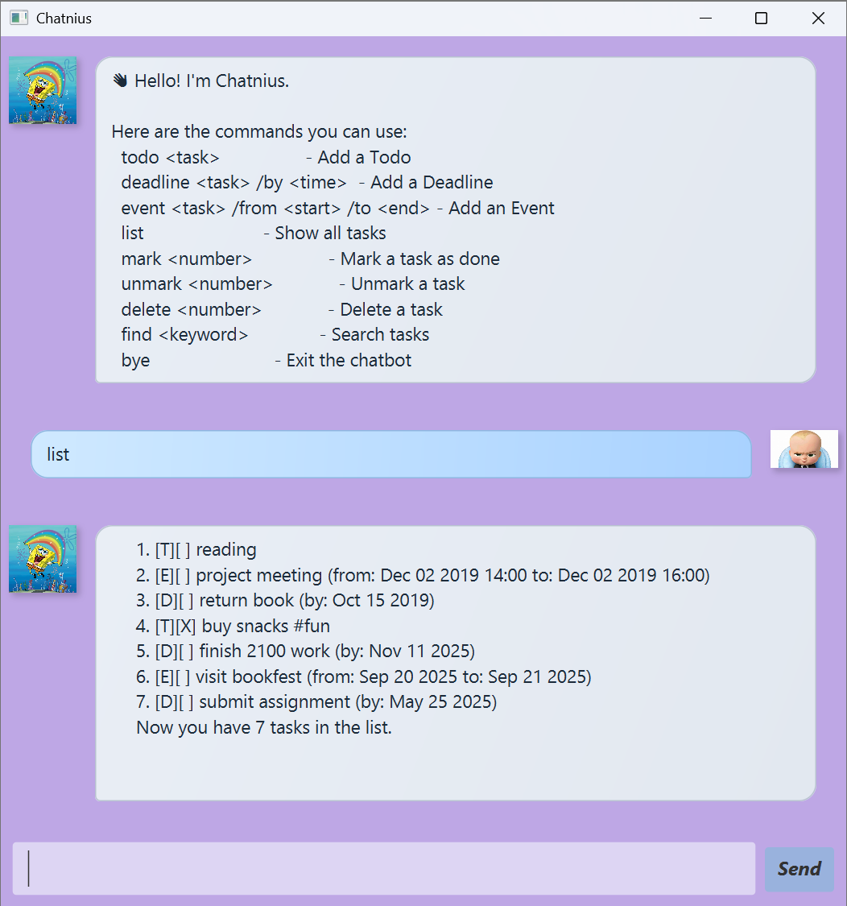

# Chatnius (Duke) — User Guide

> A lightweight task manager with a friendly chat UI. Track todos, deadlines, and events — fast.



## Quick Start

1. **Prerequisites**
    - Java 17+
    - Gradle (or use the project’s Gradle wrapper)
2. **Run**

    ```bash
    # macOS/Linux
    ./gradlew run
    
    # Windows
    gradlew run
    
    ```

3. **On first launch**
    - A **help card** lists all available commands.
    - The window is **resizable** and the chat area **auto-stretches** as you resize.
    - Press **Enter** in the input box to send your message.
4. **Data**
    - Tasks are stored in `data/duke.txt`.
    - Your list is **auto-saved** after add/mark/unmark/delete.

## Using the App (GUI Tips)

- Resize the window — content adapts automatically.
- Press **Enter** to send (no need to click *Send*).
- The chat **auto-scrolls** to the latest message.

---

## Features

### `list` — Show all tasks

**Format**

**Example output**

```
1.[T][ ] read book
2.[D][ ] submit report (by: 2025-08-30T23:59)
3.[E][ ] project meeting (from: Mon 10am to: Mon 12pm)
```

---

### `todo` — Add a Todo

**Format**

```
todo <description>
```

**Example**

```
todo read book
```

**Output**

```
Got it. I've added this task:
[T][ ] read book
Now you have 1 task in the lis
```

---

### `deadline` — Add a Deadline

**Format**

```
deadline <description> /by <time>
```

**Examples**

```
deadline submit report /by 2025-08-30T23:59
deadline CS2103 quiz /by next Fri 6pm
```

**Output**

```
Got it. I've added this task:
[D][ ] submit report (by: 2025-08-30T23:59)
Now you have 2 tasks in the list.
```
---

### `event` — Add an Event

**Format**

```
event <description> /from <start> /to <end>
```

**Example**

```
event project meeting /from Mon 10am /to Mon 12pm
```

**Output**

```
Got it. I've added this task:
[E][ ] project meeting (from: Mon 10am to: Mon 12pm)
Now you have 3 tasks in the list.
```

---

### `mark` — Mark a task as done

**Format**

```
mark <index>
```

**Example**

```
mark 1
```

**Output**

```
Nice! I've marked this task as done:
[T][X] read book
```

> Indices are 1-based (use numbers from list).
>

---

### `unmark` — Mark a task as not done

**Format**

```
unmark <index>
```

**Example**

```
unmark 1
```

**Output**

```
OK, I've marked this task as not done yet:
[T][ ] read book
```

---

### `delete` — Delete a task

**Format**

```
delete <index>
```

**Example**

```
delete 2
```

**Output**

```
Noted. I've removed this task:
[D][ ] submit report (by: 2025-08-30T23:59)
Now you have 2 tasks in the list.
```

---

### `find` — Search tasks (case-insensitive)

**Format**

```
find <keyword>
```

**Example**

```
find book
```

**Output**
```

Here are the matching tasks in your list:

1.[T][ ] read book

2.[E][ ] book club (from: Sat 3pm to: Sat 5pm)

```
---

### `bye` — Exit the app
**Format**
```

### `bye` — The app will close after a goodbye message.